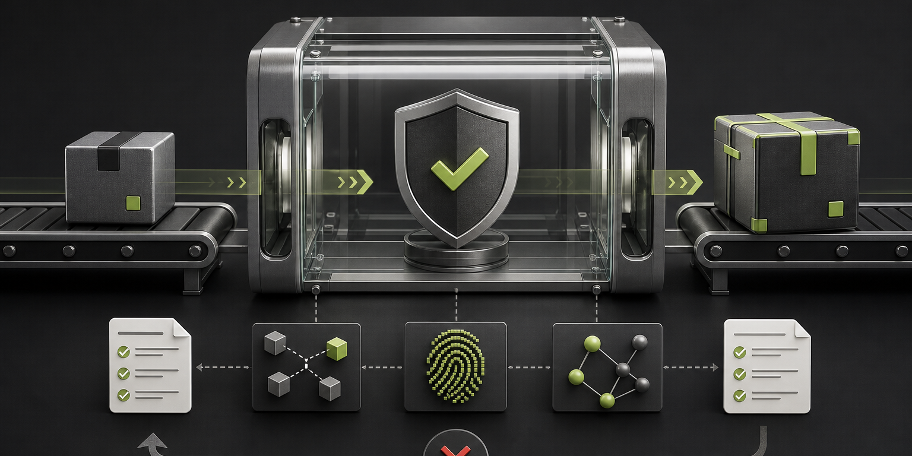

<p align="center">
  
</p>

# OpenClaw Safe Upgrade Rehearsal Kit

<p align="center">
  Rehearse the upgrade before your runtime has to.
</p>

<p align="center">
  <a href="https://github.com/pdurlej/openclaw-skill-safe-update/actions/workflows/validate.yml"></a>
  <a href="https://github.com/pdurlej/openclaw-skill-safe-update/actions/workflows/validate.yml"></a>
  <a href="https://clawhub.ai/pdurlej/safe-upgrade-rehearsal"></a>
  <a href="LICENSE"></a>
  
</p>

This project gives humans, Codex, and OpenClaw a repeatable way to inspect an
OpenClaw update before touching a live installation. It downloads exact npm
artifacts, verifies their identity and integrity, compares package surfaces,
checks deployment-specific customizations, and emits a hash-bound evidence
bundle.

**Dry run only:** this project does not update OpenClaw. It never deploys,
restarts services, executes package lifecycle scripts, or treats a green report
as permission to mutate production. When required evidence is missing or a
compatibility check fails, it returns `blocked` and stops instead of guessing.
That is what “fail closed” means here.

## Why this exists

An OpenClaw installation is usually more than the `openclaw` package. Channels,
plugins, native dependencies, MCP tools, memory, provider routing, wrappers, and
local overlays can all move independently. A release can therefore install
cleanly while quietly removing something the operator relies on.

The process behind this kit has already guided two upgrades of a heavily
customized OpenClaw instance. The preparation was deliberately thorough and
occasionally long; the actual upgrades were uneventful. Each future upgrade
will contribute another set of field notes here.

## Install as a skill

### OpenClaw via ClawHub

Install the published skill and verify its ClawHub trust envelope:

```bash
openclaw skills install @pdurlej/safe-upgrade-rehearsal
openclaw skills verify @pdurlej/safe-upgrade-rehearsal --card
```

### OpenClaw via Git

OpenClaw supports Git-backed skills directly:

```bash
openclaw skills install git:pdurlej/openclaw-skill-safe-update@main
openclaw skills info openclaw-safe-update
```

Then ask:

```text
Use /openclaw-safe-update to rehearse my current OpenClaw version against an exact target version. Stop before apply.
```

See the official [OpenClaw skills documentation](https://docs.openclaw.ai/tools/skills)
for workspace, global, and agent-specific installation options.

### Codex

Ask Codex:

```text
Install the openclaw-safe-update skill from https://github.com/pdurlej/openclaw-skill-safe-update and use it to rehearse my next OpenClaw update.
```

Or use the bundled Codex skill installer explicitly:

```bash
python3 "${CODEX_HOME:-$HOME/.codex}/skills/.system/skill-installer/scripts/install-skill-from-github.py" \
  --repo pdurlej/openclaw-skill-safe-update \
  --path . \
  --name openclaw-safe-update
```

Invoke it in the next Codex turn with `$openclaw-safe-update`.

## Run the rehearsal directly

Use exact versions. Include every separately distributed package your runtime
depends on.

```bash
python3 scripts/openclaw_safe_update.py fetch \
  --current-version 2026.6.11 \
  --target-version 2026.7.1 \
  --packages-json '["openclaw"]' \
  --output-dir artifacts/input

python3 scripts/openclaw_safe_update.py simulate \
  --input-dir artifacts/input \
  --customizations assets/customizations.example.json \
  --output-dir artifacts/safe-update
```

Replace the example customization manifest with checks for your actual
wrappers, entrypoints, plugin contracts, and overlays. A vanilla deployment can
use `--allow-no-customizations`, but only after explicitly confirming that it
has no local integration surface.

## What you get

| Artifact | Purpose |
| --- | --- |
| `runtime-truth.json` | Exact package coordinates and integrity receipts |
| `synthetic-update.json` | Bounded current-to-target package diff |
| `customization-compatibility.json` | Results for every declared local contract |
| `evidence-bundle.json` | SHA-256 binding for downstream review or policy gates |
| `verdict.json` | Machine-readable `blocked` or `ready_for_operator_plan` verdict |
| `summary.md` | Human-readable review surface |

`ready_for_operator_plan` means package-level evidence passed. It does **not**
mean “update now.” A real operator plan still needs backups, a maintenance
window, runtime-specific postchecks, and an explicit approval boundary.

## Field notes

The current lessons came from real upgrade rehearsals:

- Treat core and external plugins as one dependency transaction.
- Check the exact `engines.node` range for plugins and native dependencies, not
  only OpenClaw core.
- An “offline install” is not offline when a lifecycle script can download a
  binary from GitHub.
- Prefetch release archives and native artifacts, verify them, and bind their
  bytes with SHA-256.
- Run the synthetic install against the real plugin set rather than a core-only
  approximation.
- Rehearse state migration and restoration on a disposable copy.
- Starting the gateway is only technical activation; channel, memory, MCP,
  attachment, voice, and persona behavior still need ordered E2E checks.
- Define the activation point of no return. Before it, rollback may be valid;
  after it, prefer forward recovery so channel queues and cryptographic state
  are not rewound.
- Let policy tools judge evidence. Do not let them silently become the update
  executor.

## Share your upgrade experience

Every OpenClaw deployment teaches the process something new. If an update
worked, failed, surprised you, or required a workaround, open an
[upgrade experience issue](https://github.com/pdurlej/openclaw-skill-safe-update/issues/new?template=upgrade-experience.yml).

Useful reports include:

- exact current and target versions;
- installation shape and operating system;
- relevant public plugin/package names;
- the phase that blocked or regressed;
- sanitized evidence and the eventual fix.

Never attach tokens, private configuration values, conversations, audio,
unredacted logs, or production databases. Reusable lessons will be folded back
into the skill, evidence contract, examples, and tests after validation.

## Scope

The first stable lane targets npm-global OpenClaw installations on Linux. Other
installation shapes should arrive as explicit adapters rather than pretending
the same rollback and activation rules fit every runtime.

This is an independent community project and is not an official OpenClaw
release or endorsement.

## License

[MIT](LICENSE)
