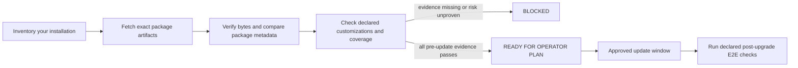

<p align="center">
  
</p>

# OpenClaw Safe Upgrade Rehearsal Kit

<p align="center">
  Know what will break before it breaks.
</p>

<p align="center">
  <a href="https://github.com/pdurlej/openclaw-skill-safe-update/actions/workflows/validate.yml"></a>
  <a href="https://github.com/pdurlej/openclaw-skill-safe-update/actions/workflows/validate.yml"></a>
  <a href="https://clawhub.ai/pdurlej/safe-upgrade-rehearsal"></a>
  <a href="LICENSE"></a>
  
</p>

No two real OpenClaw installations are quite the same. Channels, plugins, MCPs,
memory, providers, services, wrappers, and local choices turn each one into its
own system. This kit gives humans, Codex, Claude Code, and OpenClaw a repeatable
way to inspect an update against that declared system before touching the live
installation.

Let an agent do the slow comparison overnight. Before you press Enter on an
update, get an honest map of what was checked, what is risky, and what remains
unproven. The kit downloads exact npm artifacts, verifies their identity and
integrity, compares package and metadata surfaces, checks declared local
contracts, composes one exact current and target installation root, and emits a
hash-bound evidence bundle plus a post-upgrade E2E plan.

**Dry run only:** this project does not update OpenClaw. It never deploys,
restarts services, executes package lifecycle scripts, or treats a green report
as permission to mutate production. When required evidence is missing or a
compatibility or installation-coverage check fails, it returns `blocked` and
stops instead of guessing.
That is what “fail closed” means here.



## Why this exists

An OpenClaw installation is usually more than the `openclaw` package. Channels,
plugins, native dependencies, MCP tools, memory, provider routing, wrappers, and
local overlays can all move independently. A release can therefore install
cleanly while quietly removing something the operator relies on.

The process behind this kit has already guided two upgrades of a heavily
customized OpenClaw instance. The preparation was deliberately thorough and
occasionally long; the actual upgrades were uneventful. Each future upgrade
will contribute another set of field notes here.

## Install as a skill

### OpenClaw via ClawHub

Install the published skill and verify its ClawHub trust envelope:

```bash
openclaw skills install @pdurlej/safe-upgrade-rehearsal
openclaw skills verify @pdurlej/safe-upgrade-rehearsal --card
```

### OpenClaw via Git

OpenClaw supports Git-backed skills directly:

```bash
openclaw skills install git:pdurlej/openclaw-skill-safe-update@main
openclaw skills info openclaw-safe-update
```

Then ask:

```text
Use /openclaw-safe-update to rehearse my current OpenClaw version against an exact target version. Stop before apply.
```

See the official [OpenClaw skills documentation](https://docs.openclaw.ai/tools/skills)
for workspace, global, and agent-specific installation options.

### Codex

Ask Codex:

```text
Install the openclaw-safe-update skill from https://github.com/pdurlej/openclaw-skill-safe-update and use it to rehearse my next OpenClaw update.
```

Or use the bundled Codex skill installer explicitly:

```bash
python3 "${CODEX_HOME:-$HOME/.codex}/skills/.system/skill-installer/scripts/install-skill-from-github.py" \
  --repo pdurlej/openclaw-skill-safe-update \
  --path . \
  --name openclaw-safe-update
```

Invoke it in the next Codex turn with `$openclaw-safe-update`.

## Run the rehearsal directly

Use exact versions. Include every separately distributed package your runtime
depends on.

```bash
python3 scripts/openclaw_safe_update.py inventory \
  --package-root "$(npm root -g)/openclaw" \
  --output-dir .openclaw-safe-update/inventory

python3 scripts/openclaw_safe_update.py fetch \
  --current-version 2026.6.11 \
  --target-version 2026.7.1 \
  --packages-json '["openclaw"]' \
  --output-dir artifacts/input

python3 scripts/openclaw_safe_update.py contract \
  --customizations assets/customizations.example.json \
  --coverage assets/coverage.example.json \
  --output artifacts/installation-contract.json

python3 scripts/openclaw_safe_update.py simulate \
  --input-dir artifacts/input \
  --customizations assets/customizations.example.json \
  --coverage assets/coverage.example.json \
  --installation-contract artifacts/installation-contract.json \
  --output-dir artifacts/safe-update

python3 scripts/openclaw_safe_update.py attest \
  --candidate-lock artifacts/safe-update/installation-candidate-lock.json \
  --observation .openclaw-safe-update/installation-observation.json \
  --output artifacts/installation-attestation.json

python3 scripts/openclaw_safe_update.py simulate \
  --input-dir artifacts/input \
  --customizations assets/customizations.example.json \
  --coverage assets/coverage.example.json \
  --installation-contract artifacts/installation-contract.json \
  --installation-attestation artifacts/installation-attestation.json \
  --conservative-inputs artifacts/conservative-inputs.json \
  --output-dir artifacts/safe-update
```

`inventory` reads only the installed package metadata. It does not inspect
OpenClaw configuration, credentials, conversations, or service state. Complete
its `coverage.draft.json` with every channel, plugin, MCP, memory, provider,
service, persona, attachment, and voice surface you need to preserve.

The first simulation is expected to block while still producing the composed
candidate lock. `attest` then compares an explicit local observation spec with
that current root. The second simulation can become
`ready_for_operator_plan` only while the attestation is fresh and complete and
`conservative-inputs.json` contains a SHA-256 reference to verified rollback
evidence. Start from
[`examples/conservative-inputs.example.json`](examples/conservative-inputs.example.json)
and replace the placeholder digest with the digest of the real evidence.
Paths from the observation spec are never emitted. Configuration and
personalization files use `identity_only`, so their contents are never opened;
content hashing is restricted to declared package, add-on, sidecar, and
external-asset files. See
[`examples/local-installation.observation.json`](examples/local-installation.observation.json).

Replace both example manifests with checks for your actual system. A genuinely
vanilla deployment can use `--allow-no-customizations --allow-no-coverage
--runtime-node-version <exact-version> --runtime-os <os> --runtime-arch <arch>
--runtime-libc <libc>`, but that explicit escape hatch removes most of the
protection this project exists to provide.

## What you get

| Artifact | Purpose |
| --- | --- |
| `runtime-truth.json` | Exact package coordinates and integrity receipts |
| `core-candidate-lock.json` | Resolved OpenClaw dependency closure, platform/toolchain identity, and current-to-target package drift |
| `installation-contract.json` | Capability/component graph translated from the v1.1 declarations |
| `installation-candidate-lock.json` | One canonical current and target root binding core, declared add-ons, sidecars, configuration/personalization identities, contracts, environment, analyzer, and composition policy |
| `installation-attestation.json` | Fresh public-safe comparison of observed local components and service config pointers with the composed current root |
| `conservative-gates.json` | Lossless deterministic classification of unknown, migration, rollback, environment, protocol, and contract risk |
| `synthetic-update.json` | Bounded current-to-target package diff |
| `customization-compatibility.json` | Results for every declared local contract |
| `coverage-report.json` | Whether every required installation surface is represented and bound to evidence |
| `post-upgrade-e2e.json` | Ordered, still-`not_run` checks for channels, memory, MCPs, voice, persona, and services |
| `evidence-bundle.json` | SHA-256 binding for downstream review or policy gates |
| `verdict.json` | Machine-readable `blocked` or `ready_for_operator_plan` verdict |
| `summary.md` | Human-readable review surface |
| `operator-plan.md` | Rollback-aware preparation that explicitly stops before apply |

`ready_for_operator_plan` means the exact package archives, resolved OpenClaw
core closure, composed installation candidate, local installation attestation,
deterministic conservative gates, customization, runtime, and declared
installation-coverage evidence passed. Unknown or lossy authority inputs block;
resolved closure drift is always conservative, never Fast; and operator input
can only add caution or satisfy a named hash-bound evidence gate. The closure resolver uses an
isolated npm configuration, never runs lifecycle scripts, and binds exact
transitive, peer, optional, and platform-selected packages into the candidate
root. Separately distributed artifacts must use an exact version and SHA-256;
floating or unsupported identities block composition. It does **not** mean
“update now,” and it does not pretend that post-upgrade checks already ran. A
real operator still needs a verified backup, a lossless rollback, a
maintenance window, and explicit approval for the exact mutation.

The gate tells you **what is at risk, which evidence failed, and what still must
be proven**. It deliberately does not prescribe how to rewrite every local
integration. That repair belongs to the owner of the installation.

## Field notes

The current lessons came from real upgrade rehearsals:

- Treat core and external plugins as one dependency transaction.
- Check the exact `engines.node` range for plugins and native dependencies, not
  only OpenClaw core.
- Treat changed `preinstall`, `install`, `postinstall`, `prepack`, or `prepare`
  scripts as a stop condition until their external effects are understood.
- An “offline install” is not offline when a lifecycle script can download a
  binary from GitHub.
- Prefetch release archives and native artifacts, verify them, and bind their
  bytes with SHA-256.
- Run the synthetic install against the real plugin set rather than a core-only
  approximation.
- Rehearse state migration and restoration on a disposable copy.
- Starting the gateway is only technical activation; channel, memory, MCP,
  attachment, voice, and persona behavior still need ordered E2E checks.
- Define the activation point of no return. Before it, rollback may be valid;
  after it, prefer forward recovery so channel queues and cryptographic state
  are not rewound.
- Let policy tools judge evidence. Do not let them silently become the update
  executor.

## Share your upgrade experience

Every OpenClaw deployment teaches the process something new. If an update
worked, failed, surprised you, or required a workaround, open an
[upgrade experience issue](https://github.com/pdurlej/openclaw-skill-safe-update/issues/new?template=upgrade-experience.yml).

Useful reports include:

- exact current and target versions;
- installation shape and operating system;
- relevant public plugin/package names;
- the phase that blocked or regressed;
- sanitized evidence and the eventual fix.

Never attach tokens, private configuration values, conversations, audio,
unredacted logs, or production databases. Reusable lessons will be folded back
into the skill, evidence contract, examples, and tests after validation.

## Scope

The first stable lane targets npm-global OpenClaw installations on Linux. Other
installation shapes should arrive as explicit adapters rather than pretending
the same rollback and activation rules fit every runtime.

Version 1.1 keeps analysis deterministic and single-process. Parallel workers
for packages, channels, MCPs, memory, providers, and services are planned for
1.2, with one deterministic aggregator retaining ownership of the final
verdict.

This is an independent community project and is not an official OpenClaw
release or endorsement.

## Contributors

Created and maintained by [Piotr Durlej](https://github.com/pdurlej) with
[Codex](https://openai.com/codex/).

## License

[MIT](LICENSE)
